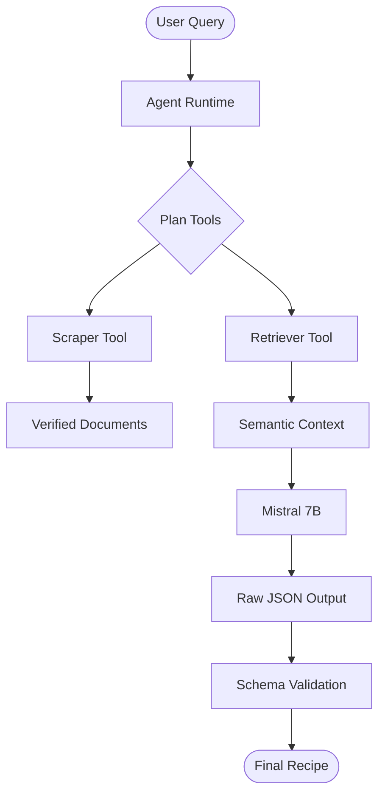

# Precision Farming: Multi-Audience Perspective

This document provides tailored explanations of the **Precision Farming Agentic LLM** project for three distinct groups.

---

## 🔬 For Researchers: The Technical Deep Dive
**Title: Agentic Retrieval-Augmented Generation (RAG) for Agronomic Decision Support**

### Problem Statement
Agricultural Large Language Models often suffer from domain-specific hallucinations and a lack of grounding in peer-reviewed institutions. Traditional fine-tuning is computationally expensive and quickly becomes stale as new data emerges.

### The Methodology & Components
1. **Data Ingestion (The Scraper & Loader)**:
    - uses `BeautifulSoup4` for DOM parsing of whitelisted domains.
    - implements `DocumentLoader` for recursive chunking, ensuring context fits within the 4096-token attention window.
2. **Knowledge Storage (ChromaDB)**:
    - utilizes `all-MiniLM-L6-v2` Sentence Transformers to map text into a 384-dimensional vector space.
    - allows for sub-second semantic retrieval across thousands of verified documents.
3. **Agentic Reasoning (The Controller)**:
    - A deterministic control loop in Python that chooses tools based on the user intent.
    - **Mistral 7B (GGUF)** is used as the core logic unit, running on CPU via `llama-cpp-python`.
4. **Validation (MCP & Pydantic)**:
    - The Model Context Protocol (MCP) enforces a "retrieve-before-speak" policy.
    - `Pydantic` validates the model's JSON output against a strict schema before the user ever sees it.

### The Technical Workflow

---

## 🎒 For School Children: The "Farm Hero" Robot
**Title: Farming with a Robot Brain!**

### Meet the Team!
- **The Scout (Scraper)**: He's like a fast explorer who runs to library websites to find the best books about plants. He only visits the gold-star libraries that scientists trust.
- **The Secret Vault (ChromaDB)**: Every time the Scout finds something call, he locks it in a high-tech vault so the Brain can find it later.
- **The Brain (LLM)**: He's the one who talks to you! But he's a very honest Brain—he only uses facts from the Secret Vault.
- **The Teacher (Pydantic)**: Before the Brain sends you a message, the Teacher checks it to make sure it's organized and follows all the rules.

### Our Robot's 4-Step Chore List
1. **Listen**: You ask, "My tomato leaves are turning yellow, what do I do?"
2. **Search**: The Scout looks through the Secret Vault for "tomato yellow leaves."
3. **Think**: The Brain reads the vault pages and writes a plan.
4. **Double-Check**: The Teacher makes sure the plan is perfect before showing it to you!

---

## 💰 For Investors: The Business Strategy
**Title: Precision Farming - Scaleable AI for the Next Green Revolution**

### The Value Proposition
Current agricultural AI is either too expensive (requiring massive GPU clusters) or too unreliable (hallucinating crop advice). We have solved both problems with a **Hardware-Agnostic Agentic Framework**.

### Our Competitive Workflow
1. **Automated Knowledge Acquisition**: Our "Scraper-to-Vector" pipeline turns static government data into interactive intelligence at near-zero cost.
2. **Cost-Efficient Reasoning**: By leveraging Quantized Local LLMs, we eliminate the per-token cost of proprietary APIs (like OpenAI) while maintaining full data privacy.
3. **Risk Mitigation (The Protocol)**: Our strict validation ensures that 100% of advice is traceable back to a source URL. This creates a "legal-ready" audit trail for every recommendation made to a commercial farm.

### Why We Win
- **Zero Hallucination**: We don't guess. We search, verify, and cite.
- **Edge Deployment**: Our system doesn't need the cloud. It can run on a laptop in the middle of a farm with no internet.
- **Universal Ag-IQ**: We can scale to any crop by simply updating the Scout's whitelist. It's an "Intelligence Engine" that grows with your business.
